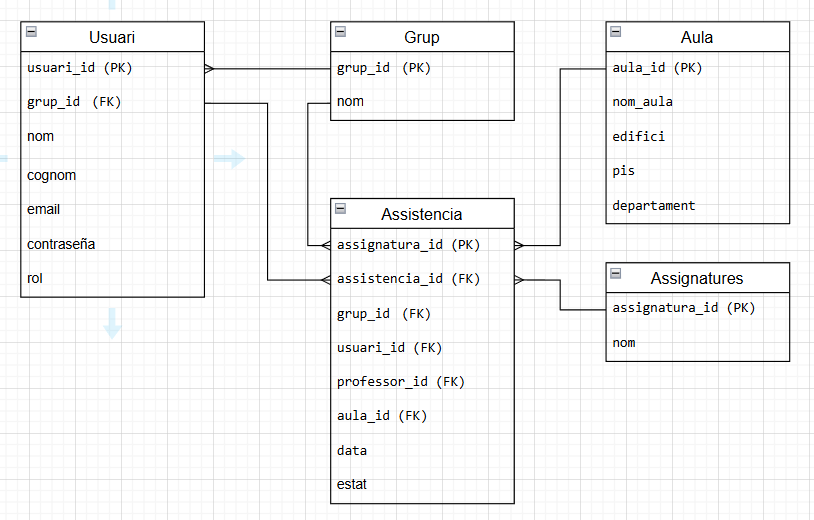

# Sprint 2 Arman, Andres Base de Dates

Aquest és el disseny de la base de dades

Relació Alumne-Grup:
Cada alumne està assignat a un grup específic (per exemple, DAW, DAM, etc.). Aquest grup conté diverses assignatures (com ara M7, M6, etc.).

Professor i Passar Llista:
Els professors que han de passar llista poden accedir a la tabla assistencia on pasa el control de presencia amb cada alumne.

L'administrador tambe te la posibilitat de pasar llista i modifica algun cas de la llista de assistencia tambe pot eliminar i afegi usuaris

